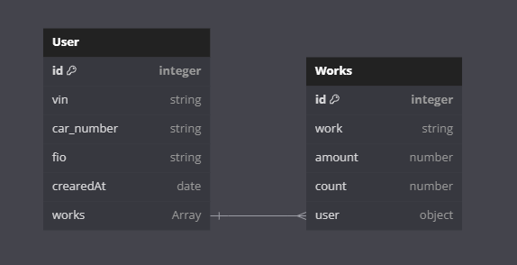

## About program
This program is for local use for the workshop network. It allows you to create a user to whom the work done on his car is linked and creates a PDF file with a report for the customer's signature. Realized customer search by: car number, vin number or customer name.

It also displays income statistics for 3 months and for the current month.

There was an attempt to realize it as an executable file (.exe). If you can finalize it, it will be cool, there is a billet.

## Future plans
Realize database backup to the cloud and its download and replacement from there. Also the ability to restore all all PDF files on the database data.

## What is used
Technologies such as Nest for Backend part and React for Frontend part are used. The main programming language is TypeScript. 

## To start the program
Before everything, you need to:
 - Create folder in the folder "data" with name "pdfs"
 - Сreate a database and design the .env file this way: 
```env
DB_HOST=''
DB_PORT=
DB_USERNAME=''
DB_PASSWORD=''
DB_NAME=''
```
After that read the .Readme files located in the corresponding parts of the project

## Server structure

<p align="center">
  <a href="" target="blank"></a>
</p>

## Stay in touch

- Author - [Nikita Endeka](https://www.linkedin.com/in/mykyta-endeka-66189625a/)
